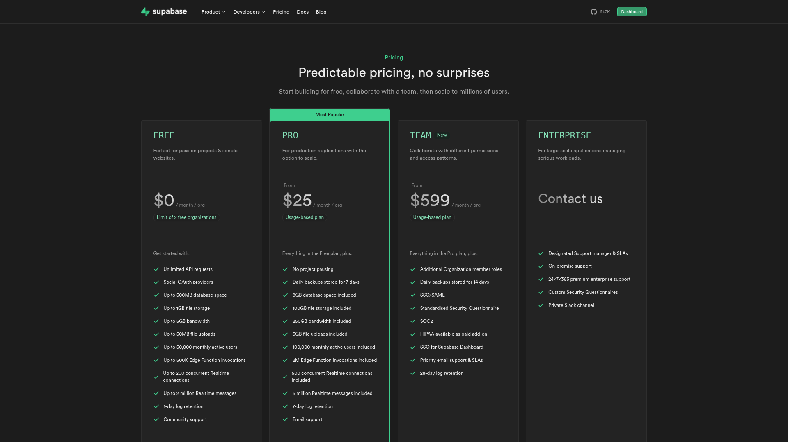
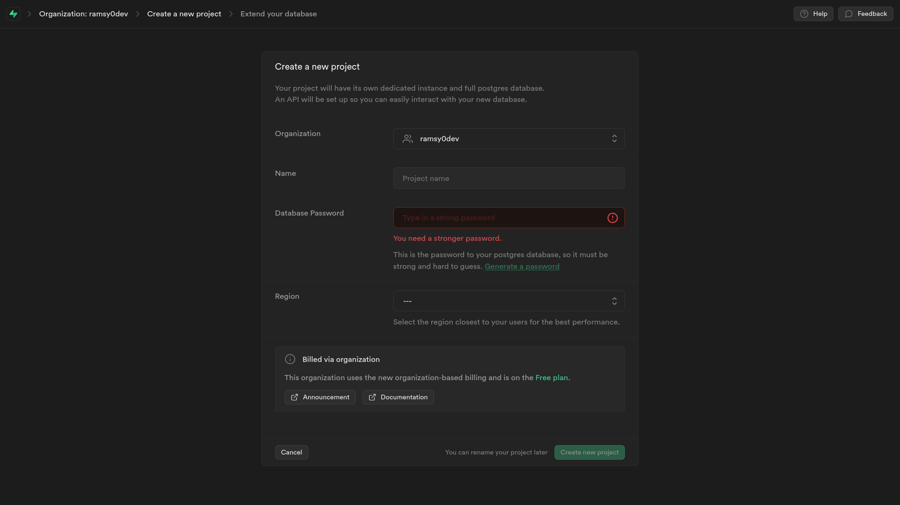
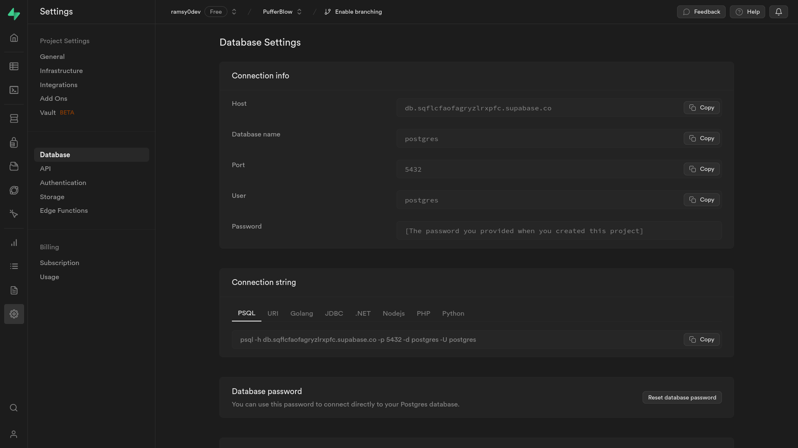

===============
Get started
===============

To get started on hosting your own `pufferblow <https://github.com/PufferBlow/pufferblow>`__ server, you will need to first setup a VPS (or you can try and host it on your local network using a spare laptop or even on your current machine), than you will need to setup `supabase <https://supabase.com>`__.

Setup a Linux VPS
=================

**steps to setup a VPS**

Setup supabase
==============

Supabase is a Firebase alternative that is open-source, which is why we are using.
To set it up, you can either use the **free plan** available at `supabase.com <https://supabase.com>`__, or you can create your own instance of it in your linux VPS or the machine that host's `pufferblow-api <https://github.com/PufferBlow/pufferblow-api>`__.

Using the free-plan
-------------------

head over to `supabase.com/pricing <https://supabase.com/pricing>`__ and choose a plan and create an account:

after that, you can then create a **new project**, give it a **name** and a **super strong database password**, select a **region**:

.. warning::

    Make sure to save your **super strong database password** safe because you are going to need it in order to connect to the database.

After creating the project, it may take up to 5min in order to setup everything, but after the setup process, head over to **the project settings** page then select **Database**, and you will see your **database's connection info**:

make sure to save them in a text file because we're going to need them when setting up `pufferblow-api <https://github.com/PufferBlow/pufferblow-api>`__
